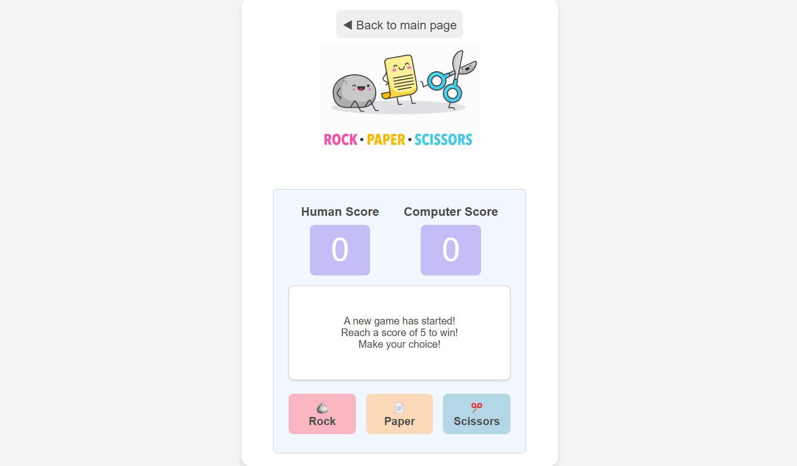

# Rock Paper Scissors

A browser-based Rock Paper Scissors game developed with HTML, CSS, and JavaScript.
This project is a part of **The Odin Project** curriculum.

🔗 Live demo: https://estellel-github.github.io/rock-paper-scissors/

## Overview

### Features

- Initially played with text input/alerts in the browser. Refactored to add UI.
- Interactive buttons for each game choice (Rock, Paper, Scissors).
- A live score display that shows the current score and declares a winner when one player reaches 5 points.
- Mobile-friendly design.
- Animated transitions and various styling/UX enhancements.

### Tools Used

- **Development:** Visual Studio Code
- **Version Control:** Git and GitHub
- **Styling and Layout:** CSS Flexbox for layout, responsive adjustments for mobile display
- Learning materials from Odin Project curriculum (Foundations) and support from their Discord community

## Learning Outcomes

- Improved skills in **UI design** and responsive styling.
- Gained experience in **event handling** by adding click events for each game option button.
- Practiced **DOM manipulation** by dynamically updating scores and displaying results.
- Enhanced JavaScript skills by implementing **conditional logic** and managing game states to track scores.
- Learned to work with **Git branches** by creating and merging a dedicated `rps-ui` branch for UI-specific changes.

## How to Use

1. Clone the repository and open `index.html` in a browser.
2. Click on a button (Rock, Paper, or Scissors) to play the game.
3. Watch the score update live until one player reaches 5 points, at which point a winner is declared.
